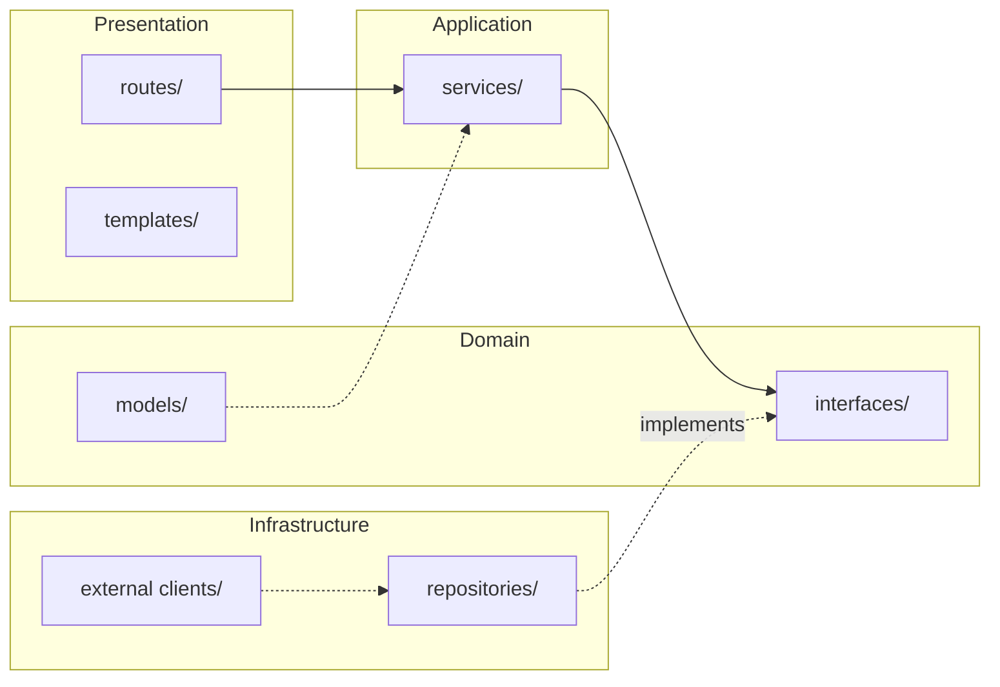
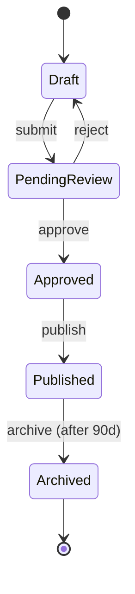
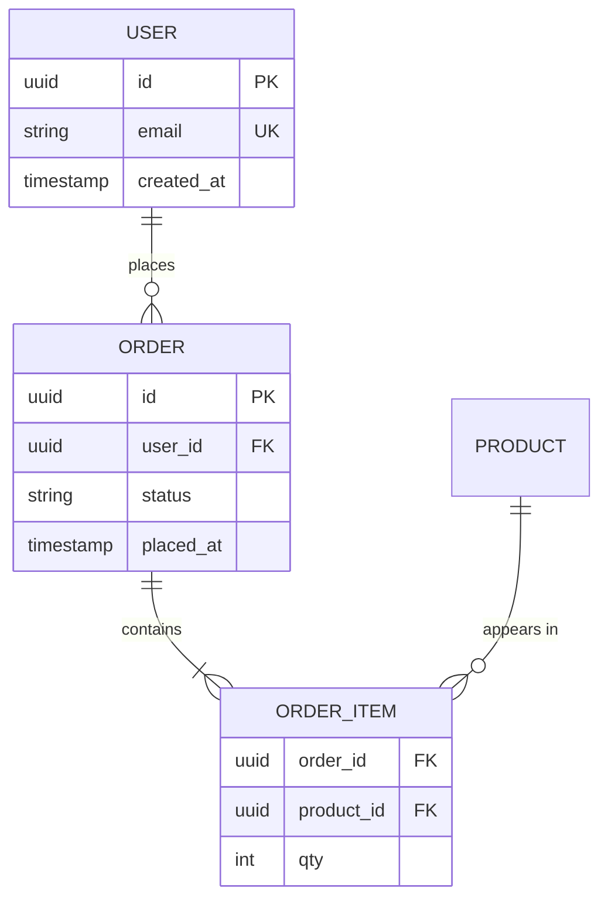
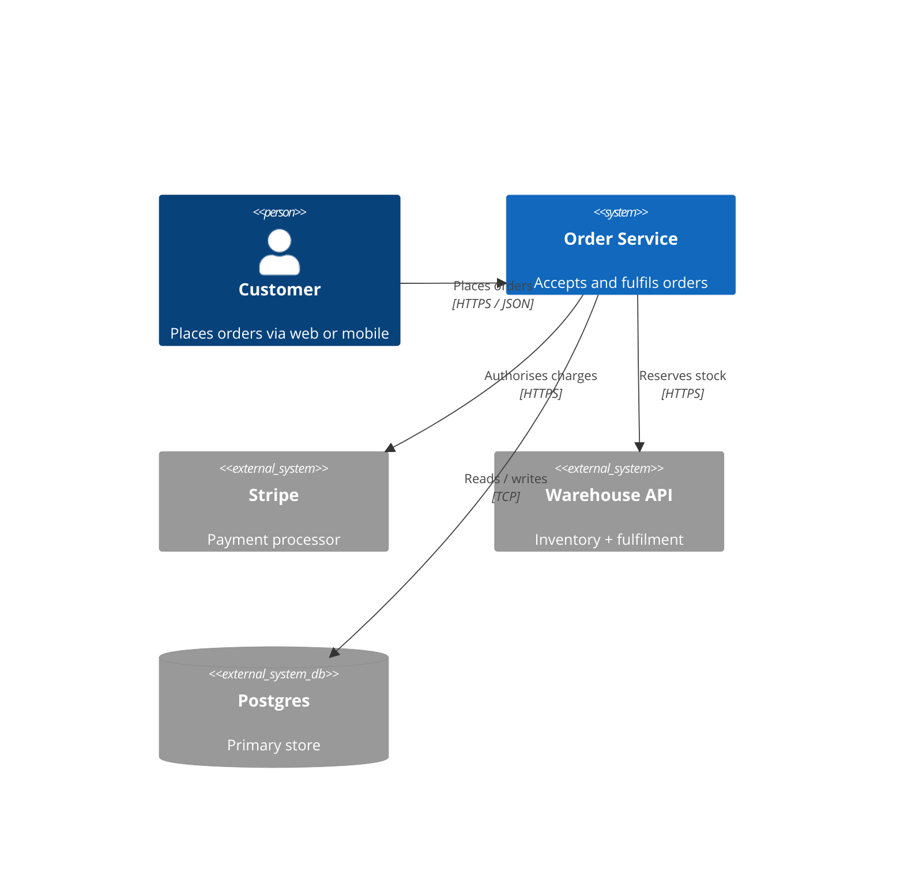
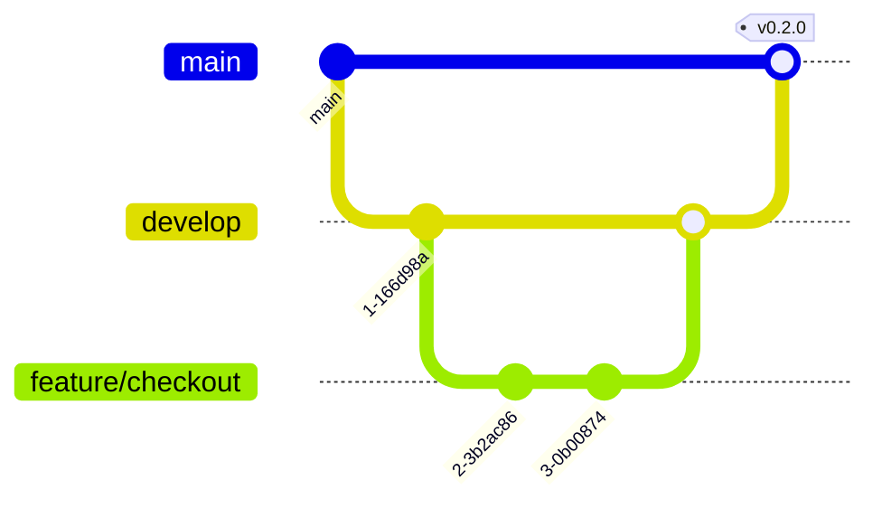
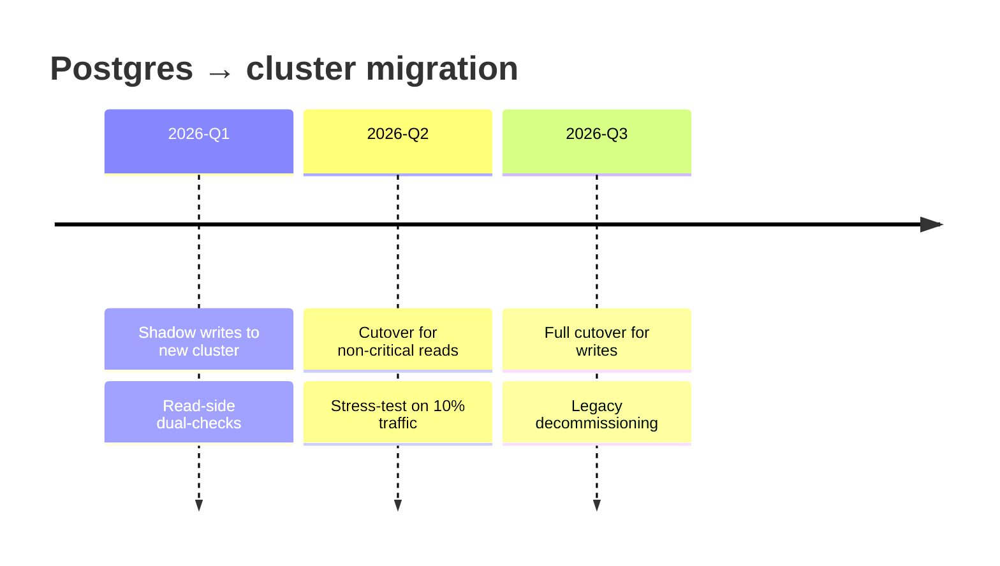

# Workflow

This rule defines the naming, contents, and ordering of the per-task artifacts so `git log`, `ls .docs/prompts/`, and `ls .docs/adrs/` together reconstruct the project's history — and the *why* behind it — from the repository alone.

Every user **task** in this repository produces, over one or more turns:

- **One prompt file** under `.docs/prompts/` capturing what was asked and why, amended across turns as the task continues (see § *Task boundaries* below for what closes a task).
- **The code, config, or docs** the task produced.
- When the change is architecturally significant — a new module, library, layer, or pattern, or a meaningful change to one — a **new or updated ADR** under `.docs/adrs/`.
- **Telemetry** kept current — new behaviour gets new logs, changed behaviour gets existing logs updated, deleted behaviour gets its logs removed, at log levels that match each event's signal (DEBUG / INFO / WARNING / ERROR / CRITICAL), with sensitive-data redaction discipline (credentials, PII, request bodies — anything that shouldn't ride a wire to a third-party log service).
- **At least one git commit** on the current branch bundling all of the above (often one per task, sometimes two when refinements deserve separation — granularity to judgement).
- **A push** of the commit(s) to the remote.

## Task boundaries

A **task** is one coherent piece of user intent that a coherent set of file changes serves. Detecting task boundaries is the agent's job, not the user's — the user should not have to explicitly say *"new task"* every time.

At the top of each turn, silently classify the turn as one of:

- **Continuing** — the turn refines, extends, or corrects the current task. Amend the existing prompt file's `## Output` section with a new bullet, or a timestamped entry under a `## Refinements` sub-section if the note is more than a line. Do not create a new prompt file.
- **New** — the turn opens a new task. Create a new prompt file. Name the previous task's status inline before proceeding (e.g. *"Previous task ('add password reset') committed at abc1234, closed"*).

Rules for the classification:

- **A commit closes the current task by default.** The next turn is presumed new unless the agent explicitly declares it as a fix-up on the just-committed work (e.g. *"continuing: correcting the missed field in commit abc1234"*).
- **Explicit user signals force a boundary.** *"Now let's..."*, *"moving on..."*, *"unrelated:"*, *"different topic:"*, *"new task:"* — any of these open a new task even mid-flow.
- **When the signal is ambiguous, continue.** The cost of a mis-continuation is a longer prompt file; the cost of a mis-new-task is directory spam. Bias asymmetric on purpose.

State the classification in one line at the top of the response, before the work — so the user sees the boundary decision the same turn it happens and can correct it cheaply. Example: *"Task: continuing 'add password reset' — refinement to the previous turn"* or *"Task: new — 'wire up SES'. Previous task committed at abc1234, closed"*.

## When this rule applies

Apply it whenever a task will generate or modify a file in the repository. A task starts with the first turn that will produce an artifact (write the prompt file then) and ends with the commit that closes it (see § *Task boundaries* above). Subsequent turns of the same task amend the existing prompt file rather than creating a new one. Typical triggers for a task starting:

- Writing, editing, or deleting source code
- Adding or updating documentation, rules, configs, or scripts
- Creating data files, fixtures, or seed content
- Renaming or moving tracked files

## When this rule does NOT apply

Skip the prompt file and the commit for interactions that produce no artifact. Examples:

- Plain conversation, clarifying questions, or brainstorming with no file changes
- Read-only investigation ("what does this function do?", "show me where X is defined")
- Advice or recommendations the user has not yet asked you to implement
- Explicit user instruction to look without changing ("just explore, don't commit")

If a conversation starts as chitchat but later produces an artifact, the rule kicks in at that point — the current turn is a new task's first turn; write the prompt file then, not for the preceding discussion.

## 1. Create (or amend) a prompt file

For a **new** task, write a file to `.docs/prompts/` using the pattern:

```
<unix-timestamp>.<snake_case_slug>.md
```

- **`<unix-timestamp>`**: seconds-since-epoch at the *first turn* of the task (e.g. `date +%s`). Keeps files chronologically sortable by filename; a continuing turn does not update it.
- **`<snake_case_slug>`**: 2–5 words summarizing the task's intent, not any single turn's ask (e.g. `fix_navmenu_client`, `home_page_structure_ideas`).

For a **continuing** task, open the existing file for the current task and amend its `## Output` section — a new bullet, or a timestamped entry under a `## Refinements` sub-section if the note is more than a line. Do not create a new file; the per-task file is what keeps the log honest about what actually happened.

### File contents

```markdown
# Request

<Verbatim or lightly-cleaned restatement of what the user asked for on the first turn of this task. Preserve intent — do not editorialize.>

## Reasoning

<Why the user asked for this: the motivation, the constraint, the trade-off being made. One short paragraph is usually enough.>

## Consulted rules

<Rules that a path or condition in the change fires, one per line as `<rule file> — <one-line summary of the trigger that fired>`. Attentional triggers (ADR, telemetry, security surface) name themselves here too when they applied, even though no path-check enforces them. Write `none` on its own line if no trigger fired. The pre-commit hook cross-checks this section against the staged paths — a mismatch is a soft fail with the missing rule name and an override syntax (`<rule> (n/a — <reason>)`) for the false-positive case.>

## Output

<What was actually done in response: files created/modified, decisions taken, follow-ups noted. Bullet list or short paragraph. Keep it factual. Amend as the task continues — append bullets, or a `## Refinements` sub-section when a turn's note is more than a line.>
```

Write the prompt file **before** or **alongside** the changes on the task's first turn, and **amend it in the same turn** as any refinement. Treat it as the task's companion note, not any single commit's.

## 2. Create or update an ADR

ADRs (Architecture Decision Records) live under `.docs/adrs/` and capture the **why** behind structural choices: which framework, which layer pattern, which library, which interaction model. Each is a single file in slim Nygard format and is indexed by `.docs/adrs/README.md`.

The prompt file records *what happened in this request*; the ADR records *what shape the project now has and why*. Many requests produce a prompt without touching an ADR — that's expected. The ADR question is only "did the architectural picture change?"

### When to create a new ADR

A request introduces a new ADR when it adds something the existing ADRs don't already cover:

- A new external dependency that shapes the architecture (a new framework, a new library, a database, an auth provider).
- A new module, layer, or pattern that future code is expected to follow.
- A decision with trade-offs worth recording — alternatives considered, constraints, deferred follow-ups.

Filename pattern: `.docs/adrs/<NNNN>-<kebab-case-slug>.md`. `NNNN` is the next free four-digit number; numbers never get reused. Append the new ADR's row to the table in `.docs/adrs/README.md` so the index stays current.

### When to update an existing ADR

A request updates an existing ADR when it modifies something the ADR already tracks:

- The chosen library is upgraded, swapped, or its configuration changes meaningfully.
- A deferred follow-up listed under **Consequences** is now done — move it out of follow-ups, mention it in the **Decision** body.
- A new constraint or trade-off surfaces that the original **Context** didn't anticipate.

If the decision is replaced rather than extended, mark the old ADR's **Status** as `Superseded by ADR-NNNN`, link forward in its body, and create a new ADR for the replacement.

### When to skip the ADR

The architecture stays the same for many changes; don't ADR them:

- Bug fixes, styling tweaks, copy edits.
- A new route handler, template, or service that fits a pattern an existing ADR already captures.
- Refactors internal to a single module that don't change its public contract.
- Renames, file moves, gitignore adjustments.

A useful test: if a future contributor reading only the ADRs would miss this change and end up confused about the project's shape, write or update one. Otherwise the prompt file alone carries the context.

### When to include a Mermaid diagram

If the change introduces or reshapes a system of components (a new layer, a multi-step flow, a per-tier policy graph, …), include a [Mermaid](https://mermaid.js.org) diagram inside the ADR. A picture of how the pieces fit together is often the fastest way for an engineer to grasp the change before reading the prose. Whether to include one depends on complexity — not every ADR needs one.

Reach for Mermaid when:

- The change involves more than two collaborators with non-trivial relationships (calls, ownership, data flow).
- The decision concerns a sequence of steps (request → service → tool → result) and the order matters.
- The decision establishes a dependency graph, class hierarchy, or state machine.

Skip Mermaid when:

- The change is a single isolated tweak (a copy edit, a config flag, a renaming).
- The prose alone makes the picture obvious in a sentence.

### Diagram-type picker

**The choice depends on the request, the situation, the problem being solved, and the proposed solution — not on a lookup table.** The table below is a menu of common matches, not a rule. Before drawing, the agent answers four questions about *this specific* ADR:

1. **What is the reader being asked to grasp?** Boundaries, ordering, state changes, proportions, comparisons, traceability, throughput, time?
2. **What did the user actually request?** A "request flow" ADR wants ordering; a "let's adopt this DB" ADR wants schema or context; a "split this into two services" ADR wants boundaries plus deployment topology.
3. **What does the problem expose?** A race-condition problem surfaces ordering (`sequenceDiagram`) and state (`stateDiagram-v2`); a scaling problem surfaces throughput (`sankey-beta`) and topology (`C4Deployment` / `architecture-beta`); a compliance problem surfaces requirement traceability (`requirementDiagram`).
4. **What does the proposed solution change?** Pick the diagram that makes the *delta* visible, not just the end-state.

**Mermaid supports many diagram types — the table below is a guide, not a closed list.** If the decision's shape fits a type not listed here, use it. The full type reference is at <https://mermaid.js.org/intro/> — consult it whenever the listed types don't quite fit, or when a newer Mermaid version has shipped a type more apt than anything below. The underlying rule is "pick whatever Mermaid type makes the shape easiest to grasp for *this* reader, given *this* request" — including types not enumerated below, and including combining multiple types in one ADR when one view isn't enough.

| Decision shape | Mermaid type | Why |
| --- | --- | --- |
| Layered architecture / dependency direction / module boundaries | `flowchart LR` (or `TB` for vertical hierarchy) with `subgraph` grouping | Shows the import arrows; subgraphs visually group layers / bounded contexts. |
| Request flow / call sequence / inter-service interaction over time | `sequenceDiagram` | Captures *order* and *participant* explicitly; activation bars show synchronous spans. |
| Entity lifecycle / process states / retry / circuit-breaker logic | `stateDiagram-v2` | Names states and transitions; supports nested composite states for sub-machines. |
| Data model / schema / relations between entities | `erDiagram` | Captures cardinality (`1:N`, `N:M`) and attribute lists; reads as a soft schema. |
| Class / type hierarchy / interface implementation | `classDiagram` | Shows inheritance + composition + interface satisfaction in one view. |
| System context — which services / users / externals touch this codebase | `C4Context` (or `C4Container` for one level deeper) | The C4 model's top levels make boundaries obvious without zooming into code. |
| Component breakdown inside a service | `C4Component` | Bridges between a `C4Container` and the actual codebase modules. |
| Deployment topology / nodes + their hosted containers | `C4Deployment` | Names physical / cloud nodes and what runs on each — the right level for infra ADRs. |
| Runtime collaboration that needs sequence + context together | `C4Dynamic` | Numbered sequence overlaid on the container/component view — useful when *where* and *when* matter equally. |
| Branching strategy / release model / git workflow | `gitGraph` | The only Mermaid type that natively models commits, branches, and merges. |
| Project plan / multi-track timeline with dependencies and durations | `gantt` | Tasks-with-bars + dependencies; right level for migration plans, multi-team rollouts. |
| Time-anchored milestones without dependency arrows | `timeline` | A horizontal time axis with grouped milestones; simpler than `gantt` when durations don't matter. |
| User journey / cross-functional workflow with subjective scoring | `journey` | Stages × actors × satisfaction; useful for UX-shaped decisions. |
| Concept map / brainstorm of related ideas | `mindmap` | Hub-and-spoke; good for early-stage decisions where the structure isn't a graph yet. |
| Categorical share / breakdown by percentage | `pie` | When the decision hinges on proportion (capacity allocation, traffic split). |
| Volume flow between sources, intermediaries, and sinks | `sankey-beta` | Widths encode magnitude; the right type for "where does our throughput go?" ADRs. |
| Quantitative chart embedded in an ADR (latency over time, cost projection) | `xychart-beta` | Line / bar charts inline; sufficient for the small charts that belong in an ADR. |
| 2×2 strategic positioning (effort vs. impact, build vs. buy) | `quadrantChart` | Forces the trade-off conversation onto two axes; good for option-comparison ADRs. |
| Multi-attribute comparison across options (radar / spider) | `radar` | When 5+ attributes matter and you want shape-at-a-glance comparison. |
| Requirement graph — requirement → satisfied-by → verified-by | `requirementDiagram` | The only built-in type for requirement traceability in safety / compliance contexts. |
| Block layout — boxes-and-connections without flowchart auto-layout | `block-beta` | When you want explicit grid control over a system diagram (rare; use sparingly). |
| Cloud / infra topology — hosts, networks, services | `architecture-beta` | Newer type aimed at infra diagrams; sometimes clearer than `C4Deployment` for cloud-native shapes. |
| Process / work board with columns and cards | `kanban` | When the ADR documents a workflow-board structure (release pipeline, intake queue). |
| Network packet structure / on-the-wire byte layout | `packet-beta` | Protocol design ADRs — header field sizes and offsets. |
| Hierarchical proportional breakdown (cost-by-service, capacity-by-tier) | `treemap` | When the shape is "what's the share of each child within each parent?" |

If the decision needs *two* views (e.g., a context diagram for boundaries + a sequence diagram for the request flow), put both diagrams in the ADR — one shouldn't crowd out the other. A single ADR with one too-busy diagram is worse than the same ADR with two focused ones.

> **Beta / experimental diagrams.** Mermaid marks several types `-beta` (e.g. `block-beta`, `sankey-beta`, `xychart-beta`, `packet-beta`, `architecture-beta`) and C4 support is still flagged experimental. They render on GitHub and on `mermaid.js.org`; some IDE Markdown previews fall back to showing the source. Use them when the audience views ADRs on a Mermaid-aware viewer; for hostile environments fall back to a labelled `flowchart` with `subgraph` boundaries.

### Worked examples

Use these as starting points to riff on — copy, adjust labels, add nodes.

**Layered architecture** (`flowchart LR` with subgraphs):



**Request flow** (`sequenceDiagram`):

```mermaid
sequenceDiagram
  participant U as User
  participant API as API route
  participant S as Order service
  participant R as Order repository
  participant DB as Postgres
  U->>API: POST /orders
  API->>S: create(order_payload)
  S->>R: insert(order)
  R->>DB: BEGIN; INSERT; COMMIT
  DB-->>R: order_id
  R-->>S: Order
  S-->>API: Order
  API-->>U: 201 Created
```

**Entity lifecycle** (`stateDiagram-v2`):



**Data model** (`erDiagram`):



**System context** (`C4Context`):



**Branching strategy** (`gitGraph`):



**Migration timeline** (`timeline`):



### Readability conventions

A diagram earns its place by being *faster to grasp than the prose*. The following keep that bar:

- **Direction matches mental model.** `LR` for flow (left-to-right reads as "from input to output"); `TB` for hierarchy (top-down reads as "from broad to specific"). Don't mix.
- **Cap soft size at ~12 nodes per diagram.** Beyond that, the diagram becomes a wall of text. Split into two focused diagrams instead — one zoomed-out, one zoomed-in.
- **Group by `subgraph`** when the diagram has 2+ clear regions (layers, bounded contexts, deployment tiers). The visual grouping does work the labels can't.
- **Name nodes by *role*, not by class name.** `Order service` beats `OrderServiceImpl`. Diagrams capture intent; class names belong in code.
- **Label edges when the relationship isn't obvious.** `A -->|publishes events| B` is worth typing; `A --> B` is fine when both sides are the same kind of thing.
- **Use solid arrows for required edges, dotted for "uses by composition / sometimes touches".** `A --> B` is "A always calls B"; `A -.-> B` is "A may consult B; the dependency exists but isn't load-bearing in every path."
- **Caption every diagram with one sentence above or below.** The sentence states what the reader should take away — "Reads flow through the cache; writes go straight to the primary." A diagram without a caption is a puzzle.
- **Stay monochrome by default.** Mermaid's auto-styling is fine; reach for `classDef` colours only when you need to distinguish two genuinely-different *kinds* of node (e.g., internal vs external systems) and a label wouldn't be enough.

GitHub renders Mermaid blocks inline; some IDE Markdown previews fall back to showing the source. Both are readable — write Mermaid as if the rendered version *and* the raw text both need to be intelligible.

### File contents

```markdown
# N. Title

- **Status**: Accepted | Proposed | Superseded by ADR-NNNN | Deprecated
- **Date**: YYYY-MM-DD

## Context
What's the situation prompting this decision?

## Decision
What did we decide?

## Consequences
What follows from this — both positive and negative. Cross-link to related ADRs by number.
```

Each ADR is short — **Context** and **Decision** usually a paragraph each, **Consequences** a bulleted list. The point is that someone can read the file in under a minute and understand both the choice and what it cost.

## 3. Ensure telemetry is in place

Code changes that don't update the project's logs are dark code: they run in production with nothing to grep for when they misbehave. Every code change must leave the observability surface coherent — new behaviour gets new log lines (at the level that matches each event's signal, not always INFO), changed behaviour gets existing logs updated, deleted behaviour gets its logs deleted.

### When telemetry must move

Add or update logs on any of these triggers:

- **New code path** — a new service method, route handler, repository, tool, middleware, or background task starts producing or transforming meaningful state. Pick the level for each event deliberately (see below). At minimum: one log for the success outcome at the level that matches the signal (DEBUG / INFO) and one at WARNING / ERROR / CRITICAL for every failure path that wasn't expected to happen.
- **Changed code path** — a method's contract, side effects, error handling, or branching changed. Walk the existing log statements and update their event names, fields, and levels to match. A log line that used to mean one thing and now means something different is worse than no log at all.
- **Deleted code path** — remove the logs that referenced it. Stale event names accumulate noise that grep eventually has to wade through.
- **New failure mode** — anywhere a `try/except` is added, the `except` branch needs at least one log call before re-raising or returning. Silent catches are observability bugs.
- **A field's meaning shifts** — if a `user_id` becomes a `session_id`, all log payloads using the old name follow. Same for renames and type changes.

If telemetry is genuinely needed but truly out of scope for the current change, capture the gap as a new file under `.docs/todos/` so it's not forgotten (rules in `workflow-todos.md`).

### Conventions

- **Module logger.** Use a module-scoped logger named after the dotted module path (e.g. `logging.getLogger(__name__)` in Python). Don't share loggers across modules — the module name is the routing key.
- **Event names** are lowercase dotted paths describing *subsystem.action* or *subsystem.action.outcome* — `chat.send.start`, `chat.send.end`, `blob.s3.put`, `auth.login.invalid_state`. Read existing log calls in the codebase before inventing a new shape; convention should be consistent.
- **Structured payloads** via the structured-fields mechanism your runtime provides (e.g. Python's `extra={...}`), never string interpolation into the message. Search, alerting, and log routing all rely on the structured fields. Keep the message string the bare event name; everything variable goes in the structured payload.
- **Levels** map roughly to:
  - **DEBUG** — fine-grained internal state useful only when actively debugging.
  - **INFO** — meaningful operations a future operator would want to see in normal traffic, INCLUDING lifecycle events (model-load milestones, warmup completions, normal start/end events). Lifecycle events live here because they're *normal* operations, not failures.
  - **WARNING** — recoverable anomalies the user noticed or the system handled but worth flagging (`auth.login.invalid_state`, `source.attach.file.too_long`).
  - **ERROR** — failures the caller has to handle, things the operator should investigate.
  - **CRITICAL** — failures or unrecoverable conditions that should wake an operator. NOT for routine boot or model-load milestones — those are INFO. The discriminator is "did something go *wrong*?", not "is this a significant moment?"
- **Timing.** For operations that can be slow, time them and include `elapsed_ms` in the payload.

### What NEVER goes in logs (sensitive data)

Treat the log stream as if it lands unencrypted on someone else's disk. *Sensitive data* is broader than *credentials* — anything that shouldn't ride a wire to a third-party log service stays out, even when it isn't a token:

- **Authentication credentials** in any form: passwords, API keys, cloud-provider access-key IDs and secret keys, OAuth client secrets, OAuth `code` grants, access tokens, refresh tokens, ID tokens, session secrets, signed cookies, Basic-auth headers.
- **Database connection passwords.** Mask the password component of a DSN before logging.
- **Encryption keys**, private keys, certificate material.
- **Verbatim exception strings on auth failures.** Some SDKs echo the access key ID on `InvalidAccessKeyId` / `SignatureDoesNotMatch`-style errors; log the canonical short error code instead.
- **PII unless it's load-bearing.** Real names, profile pictures, addresses, phone numbers, IPs, and personal preferences stay out. Email is borderline — log as a boolean (`email_present: true`) unless the value itself is the affordance being debugged. Internal UUIDs (user IDs, chat IDs) are fine — they're identifiers, not personal data.
- **Billing / financial state.** Payment-method identifiers, subscription transaction IDs from third-party processors, invoice line items. Tier names (`free`, `pro`) are fine.
- **Request bodies** — audio bytes, uploaded file contents, free-form prompt text, message content, chat titles. Log lengths, hashes, or short fingerprints if you need a needle.
- **Internal infrastructure topology** that exceeds what your `.env.example` exposes — internal IPs, hostnames not already documented, full database connection strings (even without password).

When a sensitive value's *presence* matters but the value itself doesn't, log a boolean (`token_present`, `email_present`) or a short fingerprint (first 6 chars of a hash, never the raw value).

### Audit pass on review

Before declaring a commit done, grep the diff for the logger calls and the structured payloads. For each:

- Does the level match the signal? Diagnostic-only → DEBUG; normal-traffic operation (including lifecycle / boot / model-load milestones) → INFO; recoverable anomaly the system handled → WARNING; failure the operator should investigate → ERROR; unrecoverable failure that should wake someone → CRITICAL. CRITICAL is for things going *wrong*, not for significant moments. Don't default everything to INFO either — diagnostic events still belong at DEBUG.
- Could any field carry sensitive data — a credential, token, password, unmasked DSN, PII, billing identifier, or raw user-supplied content? If yes, redact at the source.
- Is the message string a static event name (no interpolation)?
- For new failure paths: is there a corresponding log at WARNING or ERROR?

In auth, billing, admin, or any flow handling personal data, do the redaction check **twice** — once on the field as it is today, once by considering what the underlying value could become if upstream code changes.

### Security checks

Security has its own companion rule: `workflow-security.md`. The short version: changes that touch a security-sensitive surface (auth, input validation, SQL, output encoding, transport headers, secrets, logging, rate limits, dependency adds/upgrades, LLM context) walk the rubric in `.docs/security/methodology.md` *before commit*, the same way telemetry coherence is checked. The rubric is grouped by surface — read only the sub-sections that match what your change touched. Full audits remain dated sibling files under `.docs/security/<YYYY-MM-DD>-<slug>.md` on a cadence.

## 4. Commit the result

Commit granularity is a judgement call, not a per-turn rule. Often one commit per task at the end; sometimes two when refinements deserve to be separated in `git log`. Each commit includes:

- The prompt file (`.docs/prompts/<ts>.<slug>.md`).
- Any new or updated ADR file under `.docs/adrs/` (and the README index entry, if a new ADR was added).
- Every other file produced or modified while handling the request.

Commit message conventions:

- Imperative subject line under 70 characters, reflecting the prompt's intent.
- Optional body paragraph for non-obvious *why*.
- Include the co-author trailer your agent host uses (`Co-Authored-By: Claude <noreply@anthropic.com>` or the equivalent for the model running the task).

Stage files by explicit path (`git add <paths>`). Never `git add -A` or `git add .` — the prompt file, ADR, and outputs are a curated set, not everything dirty in the tree.

## 5. Capture do-later ideas under `.docs/todos/`

Deferred ideas — features the agent (or the user) suggested but didn't ship in the moment, follow-ups noted in commit messages or ADR consequence sections, scope cuts surfaced during implementation — live as **one file per idea** under `.docs/todos/`. The dedicated rule `workflow-todos.md` owns the full discipline (filename pattern, file content structure, when-to-add triggers, sweep-and-remove safeguards); this section names the per-commit obligation so the rest of `workflow.md` doesn't have to duplicate it.

Manage the directory as part of every workflow turn:

- **Add** when a deferral happens. A new file at `.docs/todos/<kebab-slug>.md` with the title + Area + Refs + Context + Deferred because + Revisit when shape from `workflow-todos.md`. Surface the draft inline in your response — *"I'll capture this in `.docs/todos/<slug>.md` as: …"* — so the user sees what lands. Add in the same commit as the related work unless the deferral is the only thing the turn produced (then it's its own commit).
- **Sweep** before staging files. Scan `.docs/todos/` for entries this change satisfies. If an entry's *Revisit when* trigger has fired, `git rm` the file in the same commit. There is no archive directory; git log is canonical.
- **Remove safely** using the three-layer safeguard from `workflow-todos.md` — scope test, cite the closing change, announce inline before pushing. When in doubt, leave the entry; cost of a stale file is small, cost of dropping in-progress work is high.
- **Update** when reality drifts — edit the file in place; its `git log` is the audit trail.

Read `workflow-todos.md` end-to-end the first time you write or remove a TODO this session — the entry shape is load-bearing.

## 6. Push the commit

Immediately after the commit lands, push it to the remote:

```
git push
```

If the branch has no upstream yet, use `git push -u origin <branch>` the first time. Push without waiting for confirmation — a commit that isn't pushed doesn't exist for anyone else, and the prompt/ADR/commit/remote chain is what makes the history trustworthy.

Exception: if the push is destructive (force-push to a shared branch, rewriting already-pushed history), stop and confirm with the user first. Same for pushes to a branch with no remote configured — tell the user and let them set the remote.

## Why this rule exists

The `.docs/prompts/` history doubles as a per-task decision log and a reconstruction aid: reading the prompts in timestamp order tells the story of what the project has done, and each file maps to one coherent task (usually one commit, sometimes two) so `git log` and `ls .docs/prompts/` stay aligned as *task*-scoped units rather than *turn*-scoped noise. A prompt file per turn produced a directory too noisy to read after two weeks; a prompt file per task keeps the log honest.

The ADRs in `.docs/adrs/` distill the architecturally significant subset — the decisions worth re-reading at scale, with their alternatives and trade-offs preserved. Reading the ADRs answers *"what is this project shaped like, and why?"*; reading the prompts answers *"what task ran on day N?"*.

Breaking any of the pairings — task without prompt file, ADR-worthy change without ADR, commit without push, or a task-continuation that spawns a new file instead of amending — erodes that guarantee.

## Amending vs. new commit

Default to new commits. Amending is acceptable only when fixing a commit that has not yet been pushed **and** the user has explicitly authorized it.
