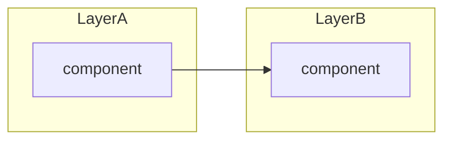
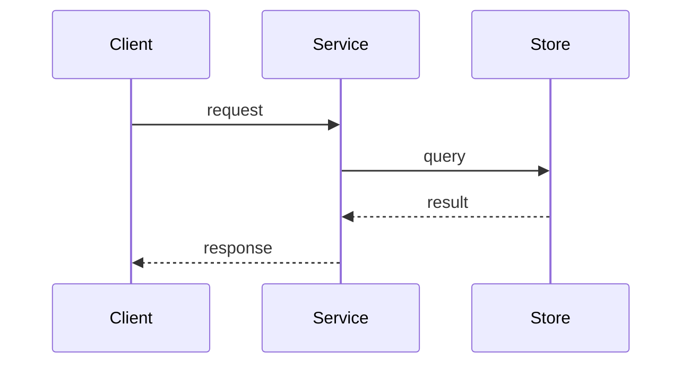
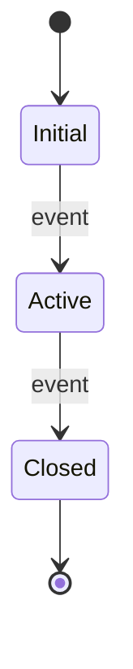
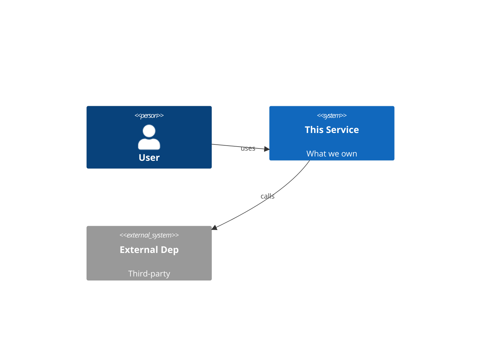

# 0. ADR Template

- **Status**: Template (not a real decision; do not cite)
- **Date**: —

## Context

What is the situation prompting this decision? What constraints, requirements, or trade-offs are in play? Keep this to a paragraph; cite related ADRs by number where they constrain or motivate this one.

## Decision

What did we decide? State it plainly.

**Pick the diagram type that fits this decision** — see the picker in [`workflow.md`'s "Diagram-type picker" section](../../.agents/rules/workflow.md). The choice depends on the request, situation, problem, and solution. Use any Mermaid type that makes the shape easiest to grasp, including types not enumerated in the picker. An ADR may carry **multiple diagrams** (e.g., a context view + a sequence view) when one isn't enough — split rather than crowd.

Skeletons to copy / adapt / delete (keep only the ones that fit this decision; delete the others):

<!-- Boundaries / dependency direction:

-->

<!-- Request flow / ordering:

-->

<!-- Entity lifecycle / state machine:

-->

<!-- Data model / schema:
```mermaid
erDiagram
  PARENT ||--o{ CHILD : relates_to
  PARENT { uuid id PK }
  CHILD { uuid id PK; uuid parent_id FK }
```
-->

<!-- System context (C4):

-->

<!-- For any other shape — gantt, gitGraph, quadrantChart, sankey-beta, requirementDiagram, C4Deployment, timeline, mindmap, pie, journey, xychart-beta, treemap, kanban, architecture-beta, classDiagram, packet-beta, radar — see workflow.md and Mermaid's reference at https://mermaid.js.org/intro/. -->

Caption every kept diagram with one sentence: what the reader should take away.

## Consequences

What follows from this — both positive and negative. Bulleted list works well:

- Positive consequence one.
- Positive consequence two.
- Cost or trade-off accepted.
- Deferred follow-up (capture under `.docs/todos/` if actionable).

Cross-link to related ADRs by number.
