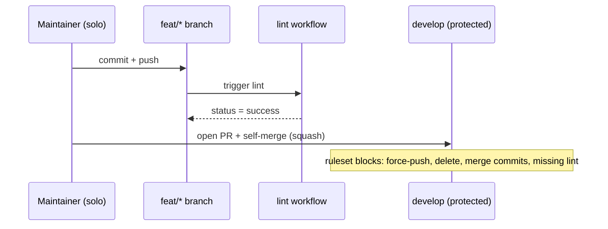

# 1. `develop` as trunk with GitHub Ruleset protection

- **Status**: Accepted
- **Date**: 2026-06-11

## Context

The project went from private experimentation to public-facing OSS through May–June 2026, and the LinkedIn launch on 2026-06-11 made external readers a real possibility. With one maintainer (Alexandre) and no co-maintainer in sight, the trunk needs to be strict enough to keep future contributors honest and loose enough not to block the maintainer's own work. The trunk is `develop` (historical choice that predates this ADR); CI is a single workflow, `lint-bootstrap.yml`, whose job key is `lint`.

## Decision

Adopt a single GitHub **Ruleset** targeting `develop` with the knobs below on. Bypass list intentionally empty.

- Restrict deletions ✓
- Require linear history ✓
- Require pull request before merging ✓ (0 required approvals — solo maintainer self-merges)
- Dismiss stale PR approvals when new commits are pushed ✓
- Require conversation resolution before merging ✓
- Require status checks: `lint` ✓
- Block force pushes ✓

Knobs off: signed commits, deployment-success gating, "branches up to date" requirement, code-scanning, code-quality, Copilot review.

The flow above: a maintainer's change always passes through a feature branch, a lint check, and a PR — even when the maintainer is the only reviewer.

## Consequences

- Direct pushes to `develop` are rejected (verified on the first commit after the ruleset went live — see [9c12fc8 push rejection in `git reflog`]).
- Solo workflow stays fluid: 0 required approvals lets the maintainer self-merge once `lint` is green.
- Scales without surgery: when a co-maintainer joins, flip Required approvals to 1; everything else stays.
- Allowed merge methods at the repo level are restricted to **Squash** only — linear-history would block merge commits anyway, and squash keeps `git log` one-line-per-PR.
- Empty bypass list means no permanent escape hatch. Hotfix paths require temporarily disabling the rule rather than baking in an exception.
- Path-filtered required status checks would deadlock the ruleset — see [ADR-0002](./0002-drop-paths-filter-from-required-lint-check.md).
