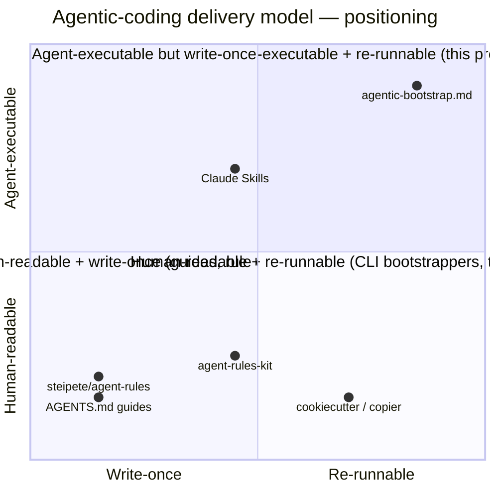

# 4. Single-file, agent-executable delivery model

- **Status**: Accepted (retroactive — captures a foundational choice that predates the ADR discipline)
- **Date**: 2026-06-11 (retro for decisions made across 2026-05 / 2026-06)

## Context

The agentic-coding tooling space in 2026 has settled into four delivery categories — each with real users, each missing something this project wants to provide:

| Category | Examples | What's missing |
| --- | --- | --- |
| CLI bootstrappers | `cookiecutter`, `copier`, [`tecnomanu/agent-rules-kit`](https://github.com/tecnomanu/agent-rules-kit) | A dependency to install, version, and chase across breaking changes |
| Static rule collections | [`steipete/agent-rules`](https://github.com/steipete/agent-rules), [`yzhao062/agent-style`](https://github.com/yzhao062/agent-style) | Copy-and-curate; nothing re-runs; nothing fans out across tools |
| Guides | [agents.md](https://agents.md), Augment, Morph, PRPM, Atlan | Words, not artifacts; reader still assembles the implementation |
| Template engines | [Cookiecutter](https://cookiecutter.readthedocs.io/), [Yeoman](https://yeoman.io/) | Write-once; drift the moment the user forks |

The AGENTS.md standard hit critical mass in 2026 (>60k repos, AAIF Linux Foundation project), which validates the shared-context-file premise but doesn't solve the *delivery* problem.

## Decision

Deliver the bootstrap as a **single Markdown file the agent reads top-to-bottom and executes as a playbook**. The file is itself the operator manual *and* the templates *and* the decision matrix *and* the interview questions. The user's commitment is one prompt — *"follow this bootstrap"* — handed to whichever agentic coding tool they already use.

Three properties make the model defensible:

1. **Agent-executable.** The agent IS the runtime. No CLI to install, no Python venv to manage, no version to track separately from the artifact.
2. **Idempotent re-runs.** State lives in `.agents/bootstrap.json` + the Canon / Mixed / Sacred ownership matrix. Re-running on a bootstrapped project picks up new conventions without clobbering user work.
3. **Cross-tool fan-out.** One autonomy intent (Q3 `POSTURE`) becomes per-tool permission configs for all eight supported tools — Claude Code, Cursor, Aider, Codex CLI, OpenCode, Continue.dev, Windsurf, Copilot.

The quadrant chart shows the open territory: agent-executable AND re-runnable. Neighbors cluster in the other three quadrants.

## Consequences

- **Differentiator is the model, not the content.** The conventions encoded (Nygard ADRs, OWASP rubric, Keep-a-Changelog, ports-and-adapters) are widely known. The novel contribution is the agent-as-runtime delivery + idempotent re-runs + cross-tool spine. Credit the prior art (see [`README.md` "Prior art"](../../README.md)).
- **Maintenance treadmill across 8 tool schemas.** Each tool can change its config shape independently. Mitigations are tracked as deferred follow-ups: community-driven adapter contributions ([TODO](../todos/community-driven-adapter-contributions.md)), Doctor mode as drift detection (already shipped), version-watch cron ([TODO](../todos/version-watch-cron-action.md)).
- **Discoverability is the real risk, not quality.** Self-published artifacts die from obscurity. AAIF outreach, awesome-list submissions, and a Show HN moment are the deliberate counter-moves (see TODOs `submit-awesome-lists`, `agents-md-case-study-pr`, `show-hn-launch`).
- **The single-file ceiling.** `AGENTIC-BOOTSTRAP.md` is already ~321 KB. Each new architecture variant / language scaffold / tool adapter grows it. Long-term, splitting into `tools/<tool>.md` partials is on the table — but only when the monolith becomes painful to read or contribute to (see [`community-driven-adapter-contributions.md` TODO](../todos/community-driven-adapter-contributions.md)).
- **No CLI install means no telemetry.** We never learn who's running it. Acceptable trade-off — the discipline ([`workflow-security.md`](../../.agents/rules/workflow-security.md)) rules out telemetry anyway; GitHub Stars / Discussions / issue volume are sufficient signals.

Related: [ADR-0001](./0001-develop-trunk-with-ruleset-protection.md) (governance), [ADR-0005](./0005-custom-domain-agentic-bootstrap-md.md) (brand).
