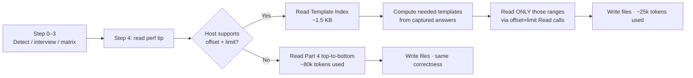

# 8. Offset-read template index for Part 4

- **Status**: Accepted
- **Date**: 2026-06-11

## Context

`AGENTIC-BOOTSTRAP.md` is ~5,000 lines / ~80k tokens read top-to-bottom — the operator playbook (Part 1), the 17-question interview (Part 2), the decision matrix (Part 3), and ~80 file templates (Part 4) covering every supported language, architecture, agentic tool, posture variant, and feature gate. Any given bootstrap run touches a small fraction of those templates — Python + 4-Layer DDD + Claude-only + TRUSTED_DEV needs roughly 15 of the 80. Reading the other 65 is pure context waste.

Three constraints framed the fix:

1. **The bootstrap must stay self-contained.** Design principle 1 ([`README.md`](../../README.md)) — no `curl`, no `WebFetch` for the bootstrap itself. The agent that runs it may not have network tools.
2. **Backward compatibility with naive readers.** Agents whose Read tool lacks `offset` + `limit`, or hosts that ignore custom instructions, must still produce a correct bootstrap.
3. **No content loss.** Templates can't be inlined or deduplicated without changing the artifact's value proposition.

## Decision

Add a **Template Index** subsection at the start of Part 4. Each row maps a template to its trigger flag (`Always`, `ARCH=X`, `LANG=Y`, etc.) and its `start → end` line offsets within `AGENTIC-BOOTSTRAP.md`. Pair it with a **performance tip** at Part 1 Step 4 that tells offset-capable agents to use the index for selective reads.

The flow above: smart agents take the left branch, naive agents take the right; both produce correct output, only the token cost differs.

## Consequences

- **~60–70% scaffold-time token cost reduction for capable agents** (~80k → ~25k). The 5,000-line file is now shaped like a library: read the playbook + interview + matrix + index, then dispatch to the templates the answers actually want.
- **Naive readers are unchanged.** Agents whose Read tool can't take an `offset`, or hosts that strip the instruction, fall through to top-to-bottom reading — same as before, no regression. Honors design principle 1 (self-contained).
- **Maintenance: the index must stay in sync with file edits.** Adding a new template, renumbering Q-questions, or any insertion that shifts Part 4 line numbers requires updating the table. The included drift safeguard ("if an offset doesn't land on `### Template:`, re-grep") protects users from minor drift, but doesn't prevent maintainer accidents.
- **Follow-up tracked at [`.docs/todos/lint-template-index-offsets.md`](../todos/lint-template-index-offsets.md)**: add a lint check that re-derives the index from `^### Template:` positions and diffs against the committed table. CI failure on drift. The current four-check lint (`scripts/lint_bootstrap.py`) would gain a fifth.
- **Landing page updated** ([`docs/index.html`](../../docs/index.html) `#footprint` section) to reflect the three-number story — smart scaffold (~25k), naive fallback (~80k), runtime (~10k). The middle number is the backward-compatibility safety net; the first is the win.

## Alternatives considered

- **URL-fetched manifest.** A short `bootstrap.manifest.json` hosted at the project's GitHub Pages site, fetched by the agent. Drops file size meaningfully — but violates design principle 1 (the agent must work offline / behind firewalls). Rejected.
- **Full file split into `tools/<tool>.md` + `architectures/<arch>.md` partials.** Bigger savings (~70%), better for tool-churn contributions. Already tracked at [`.docs/todos/community-driven-adapter-contributions.md`](../todos/community-driven-adapter-contributions.md). Defers because it breaks the single-file pitch unless coupled with an embedded fallback (which adds complexity). The offset-read index achieves much of the savings without that cost.
- **No-op (status quo).** Smart agents would continue reading the full file. Acceptable today but compounds against the project as new architectures, languages, and tools land — the file grows ~10% per quarter; reading-cost grows with it. Doing nothing was the worst long-term option.

Related: [ADR-0004](./0004-single-file-agent-executable-delivery-model.md) (the single-file delivery model whose token cost this ADR addresses).
