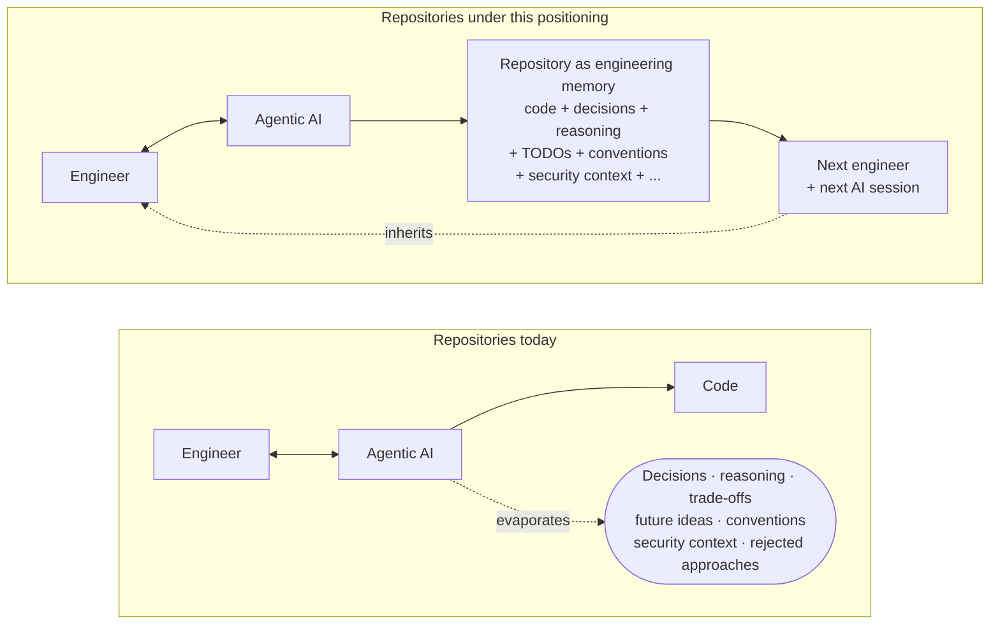

# 10. Reposition as engineering operating model for human–AI software development; supersede ADR-0009

- **Status**: Accepted (supersedes [ADR-0009](./0009-reposition-as-engineering-memory-system-with-ab-test.md))
- **Date**: 2026-06-30

## Context

[ADR-0009](./0009-reposition-as-engineering-memory-system-with-ab-test.md) repositioned the project as an *engineering-memory system* and A/B/C-tested the new framing on the landing-page hero. That repositioning was a step forward — it moved every public surface away from mechanism-first ("one markdown file, any agent, one prompt") toward consequence ("AI sessions end; engineering knowledge shouldn't"). The hero pinned to variant B while baseline data accumulated; the README's lede and "What lands" table pivoted in parallel.

A subsequent product-strategy review found the positioning still describes the **consequence** rather than the **underlying problem**. *Repositories should remember engineering* is true but inert — repositories have always failed to remember engineering, and that fact alone doesn't explain why **now** is the moment to fix it. The actual change in the world is this:

> Agentic AI has fundamentally increased the amount of engineering knowledge produced during a software-engineering session.

A single afternoon of human–AI collaboration now generates more architectural alternatives, trade-off discussions, rejected approaches, future ideas, naming decisions, security considerations, testing ideas, and implementation rationale than a typical week of solo work. The bottleneck used to be *creating* engineering knowledge; the bottleneck is now *retaining* it. This is a category-creation argument — parallel to Infrastructure-as-Code emerging when cloud became programmable, GitOps emerging when Kubernetes reshaped infrastructure management, containerization emerging when deployment shapes changed. AGENTIC_BOOTSTRAP exists because agentic AI changed software engineering; the substrate it installs is what makes the resulting engineering knowledge durable.

The implications: ADR-0009's hero copy, the structural plan tracked in [`landing-positioning-restructure.md`](../todos/landing-positioning-restructure.md), and the "five-memory-types ↔ artifacts" framing all need to be revised — they still lead with *what the bootstrap produces* (a memory substrate) rather than *what just changed in software engineering, and why repositories now need this*. The new positioning supersedes ADR-0009; the A/B/C experiment infrastructure that ADR-0009 introduced survives intact, but only one variant ships now (the new curiosity-led copy) with the engine wired for future tests.

## Decision

**Adopt as the project's primary noun phrase:** *an engineering operating model for human–AI software development*. Lead every public surface with the **category shift** — agentic AI changed how much engineering knowledge a session produces — before introducing the project name, the substrate, or any artifact. The substrate (`AGENTS.md`, `.agents/rules/`, `.docs/adrs/`, `.docs/prompts/`, `.docs/todos/`, `.docs/security/methodology.md`) is reframed as *evidence of the philosophy*, not the philosophy itself.

**Tagline:** *"Agentic AI has made engineering knowledge abundant. AGENTIC_BOOTSTRAP makes it durable."*

**Landing-page hero** ([`docs/index.html`](../../docs/index.html)) — one curiosity-led variant:

- **Eyebrow:** *An engineering memory system for AI-coded repos* — chosen for grasp-at-a-glance simplicity over the more abstract *"operating model for human–AI software development"* phrasing (the latter survives as the project's positioning noun in the README and ADRs, just not on the landing surface where first-read clarity matters more).
- **H1:** *Software · engineering · changed.* (each word on its own line, staircase rhythm) → *Repositories haven't.* (line 4, `text-gradient` for emphasis). The four-line stack creates dramatic pacing on the category-shift assertion before the gap-revealing punchline.
- **Lede:** *Agentic AI has made engineering knowledge **abundant**. AGENTIC_BOOTSTRAP makes it **durable**.* — the brief's tagline verbatim; `font-medium` on the *abundant / durable* contrast pair.
- **Subhead:** *One markdown file. Any agentic coding assistant. One prompt. Your repo grows the engineering memory a Senior Engineer would have set up on day one — workflow rules, ADR culture, the testing pyramid, telemetry, security rubric, TODO discipline — then bundles every change into one focused git commit. Tool-agnostic. Cross-stack. Idempotent.* — the **bootstrap quality** is carried here, immediately under the philosophical lede, so the visitor doesn't have to scroll to grasp the action the project performs. Adapted from the pre-positioning subhead by swapping *discipline* → *engineering memory* to land inside the new noun phrase.

The hero is **hybrid** by design: the eyebrow + H1 + lede create the curiosity gap, and the subhead + terminal codeblock supply enough concrete identity (one file, runs through your agent, scaffold lands) that the visitor doesn't bounce on philosophy alone. This is a softening of the brief's stricter "create curiosity only, no mechanism" guidance — kept as a deliberate trade-off because the project's *bootstrap-ness* is identity-level, not mechanism-level, and stripping it strips what the project IS.

**A/B/C engine.** The variant-selection infrastructure from ADR-0009 (synchronous `<head>` IIFE; `localStorage` stickiness; bot pinning; `gtag` `experiment_view` event; CSS attribute selectors hiding non-matching `data-hero-variant-block` elements; `FORCE_VARIANT` override) is preserved end-to-end. Only the variant blocks in `<body>` collapse to one (`data-hero-variant-block="A"`), and `pickWeighted()` is reduced to `return 'A'` with a comment explaining how to re-enable a multi-arm split. `FORCE_VARIANT` stays at `'A'`. Adding a future variant B (or D, etc.) is a localized change: add a sibling `data-hero-variant-block` block in `<body>`, restore the weighted roll in `pickWeighted()`, set `FORCE_VARIANT = null`.

**Landing-page structure** (R2–R7, captured in [`landing-restart-operating-model.md`](../todos/landing-restart-operating-model.md)). The new section order moves value before mechanism:

1. Hero (this commit)
2. *What just changed in software engineering* — body prose, no artifact names
3. *The new bottleneck* — creation → retention; why repositories aren't built for it
4. *Why now* — IaC / GitOps / containerization parallel
5. *What "durable engineering knowledge" actually looks like* — categories of knowledge, no file names
6. *The substrate* — first introduction of the artifact list, framed as evidence
7. *A single human–AI session, before and after* — vignette
8. *How it works* — existing 3-step, reframed
9. *Runtime footprint* — kept and repositioned. Currently framed as *"heavyweight at scaffold time; lightweight forever after"*; reframed under the new spine to answer the durability-cost objection the new positioning provokes — *the substrate is durable AND doesn't tax every session*. The three-card structure (smart-agent scaffold ~25k · naive-fallback scaffold ~80k · every session after ~10k) stays.
10. *What this is — vs what it isn't* — comparison vs Cursor Rules / Copilot instructions / Claude skills / bare AGENTS.md
11. *Tool-agnostic* — 8-tool list (moved out of hero into its own band)
12. *Architectures · postures* — collapsed to one paragraph + README link
13. *Adoption · footer* — unchanged

**README** pivots in R7 — the same shift in framing applied to the README's lede, "What lands" table, and "Why one file, not a template or CLI" sections.

*Before: only code survives the session — every other artefact of the collaboration evaporates. After: the repository itself becomes the substrate every subsequent session reads on entry and contributes back to on exit.*

## Consequences

- **Supersedes ADR-0009.** ADR-0009's *engineering-memory system* framing was a step toward this position but stopped short of naming the category shift. Its status line is updated to `Superseded by ADR-0010`; the body is preserved for history (the A/B/C experiment infrastructure it documents remains active under this ADR).
- **Stale TODO replaced, not edited.** [`landing-positioning-restructure.md`](../todos/landing-positioning-restructure.md) is removed (`git rm` in this commit) and replaced by [`landing-restart-operating-model.md`](../todos/landing-restart-operating-model.md). Its 8-phase plan and "5 memory types ↔ artifacts" framing don't survive the reframe.
- **A/B engine kept; variant set collapsed.** Future tests cost a few lines (add a new `data-hero-variant-block` block + restore weights in `pickWeighted` + set `FORCE_VARIANT = null`). No infrastructure was deleted — only the B and C variant blocks in `<body>`. `experiment_view` continues to fire with `variant: "A"` and `experiment_id: "hero_2026_q3"`; baseline-conversion data from the pre-supersede pinned-to-B window remains in GA4 and can be retroactively segmented by `experiment_view` time-range.
- **Right-column terminal codeblock kept.** The terminal-styled visual (showing the bootstrap interview Q&A and the resulting scaffold file tree) stays beside the hero copy in a 7/5 grid split. An earlier draft of this ADR proposed removing it on a strict reading of the brief's *"no implementation in the hero"* guidance; user feedback ([prompt 1782852148](../prompts/1782852148.hero_simplify_eyebrow_h1_subhead_terminal.md)) clarified that the terminal visual is identity-level (it's what *bootstrap* looks like), not mechanism-level, and that removing it amputates a core affordance — *this is a thing you can run, and here is what running it looks like in five lines*. The visual stays; replacement with a different illustration would itself be an ADR-worthy decision.
- **Auxiliary hero chrome stays transitionally.** The four checkmarks (Project-agnostic · Re-runnable · No dependencies · One file) and the eight-tool *Works with* strip are not philosophy and don't fit the new hero spine, but deleting them in R1 would leave a product-information gap until R6 re-stages them in dedicated bands below the philosophical sections. They stay as transitional chrome and migrate cleanly in R6.
- **CHANGELOG not bumped.** This change does not touch `AGENTIC-BOOTSTRAP.md`'s header version. Landing-page positioning lives outside the artifact lint contract.
- **OG / meta tags not changed in R1.** They currently encode the variant-B copy from ADR-0009. They will be updated in R2 or R3 once the body text settles around the new framing — changing them in R1 alone would mismatch the live page during the in-flight restructure. Crawlers therefore still see *"AI sessions end. Engineering knowledge shouldn't."* until the meta sweep lands; acceptable as a short transient.
- **The substrate's substance doesn't change.** ADRs, prompts, TODOs, security rubric, rules, best-practices, the bootstrap artifact itself — none of these files or their contents shift. Only the *story we tell about them* shifts. The bootstrap remains a single-file, self-contained, idempotent, tool-agnostic operator playbook.
- **Runtime footprint kept.** The existing *Runtime footprint* section (~25k smart-agent scaffold / ~80k naive-fallback scaffold / ~10k every session after) is structurally important under the new positioning — it answers the implicit *"won't this engineering-memory substrate cost a fortune in tokens?"* objection that the new framing surfaces. Section stays; its copy gets a light reframe in R6 to lead with *durability without per-session tax* rather than *heavyweight scaffold / lightweight runtime*.
- **Stronger commitments downstream.** Any future ADR that adds a substrate artifact, a rule, or a tool adapter should reason from *"does this strengthen the durability of the engineering knowledge a human–AI session produces?"* — not from *"does this add a feature?"* The framing is load-bearing.

Cross-references: [ADR-0004](./0004-single-file-agent-executable-delivery-model.md) (single-file delivery model — the substrate this ADR reframes); [ADR-0005](./0005-custom-domain-agentic-bootstrap-md.md) (custom domain — the surface this ADR now reshapes); [ADR-0009](./0009-reposition-as-engineering-memory-system-with-ab-test.md) (superseded by this ADR — its A/B/C engine infrastructure remains active).
